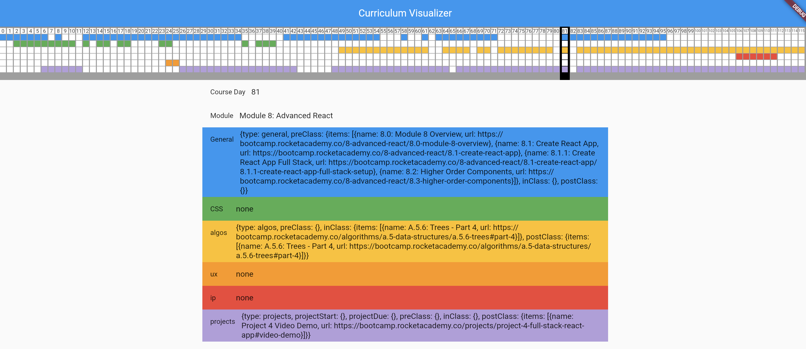

# schedule_manipulation

A new project for getting a bird's eye view of the bootcamp curriculum

## What's here

- there are the curriculum json files in `assets/data`
- There are some python files for direct data manipulation
- There's a flutter project for visualization

